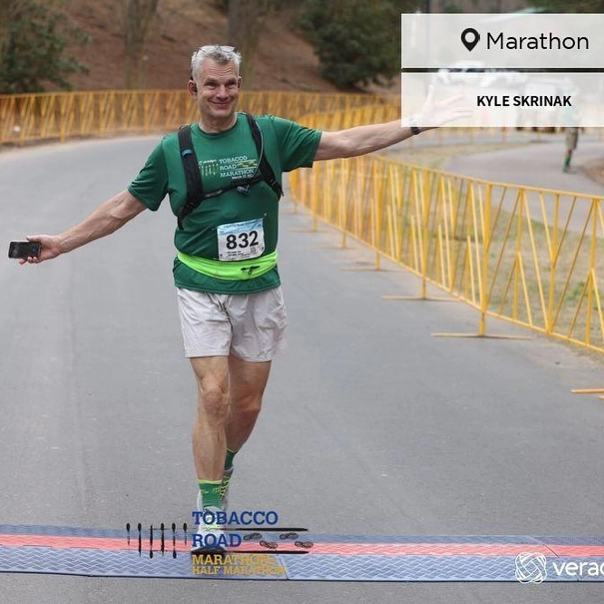
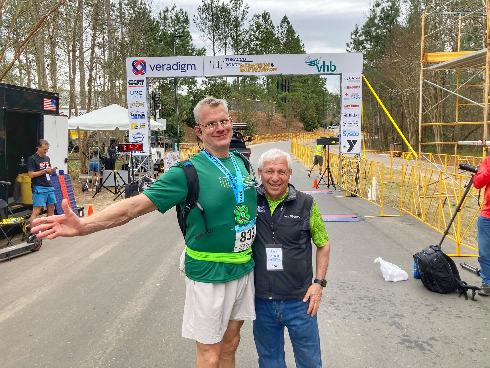
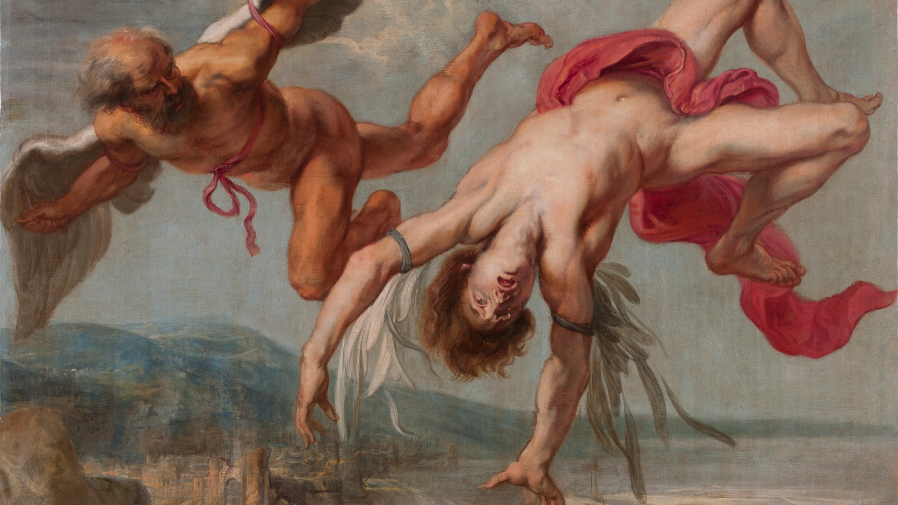

*"Icarus, I recommend thee to keep the middle tract; lest, if thou shouldst go too low, the water should clog thy wings; if too high, the fire of the sun should scorch them. Fly between both."*
— Ovid, *Metamorphoses*, Book VIII (trans. Riley, 1851)

---

## Strangers with Mustard Packs

The Tobacco Road Marathon starts and finishes at the USA Baseball National Training Complex in Cary, North Carolina. The course follows the American Tobacco Trail, a rails-to-trails path built on the former Norfolk Southern Railroad that once served tobacco farming communities. It's a Boston qualifier, with up to fifteen percent of finishers qualifying, and is known for its flat, fast route and March temperatures in the forties and fifties. With tall pines lining the trail, most of the race feels like a run through the woods. The event is well organized, genuinely enjoyable, and on March 20, 2024, the conditions seemed ideal for a great day.

But the day didn't unfold as planned.

At mile 6, a speed walker passed me, steady at around a 12:15 pace, while I was at 12:30. She shared she had started speed walking to avoid leg cramps, which struck me at the time as extreme.

At mile 17, I hit "the wall." I begged a fellow runner for mustard, and he handed me packets for my cramps. They helped almost immediately. He vanished back into the race.

The American Tobacco Trail is flat-ish. Runners appreciate its rolling inclines and declines. The inclines on the return leg compounded what was already there. I was slowing. The cramping was there, but the mustard packets weren't.

My wife and two dear friends were at a water stop not long after. They were loud, warm, and enthusiastically cheering me on. Exactly what you need on the back half of a marathon.

The morning of the run, I filled my CamelBak with Ninja-blended berries, my carb concession. The pits clogged it. By mile 14, it stopped working. Just as I needed fuel most, it failed.

Shortly after the turnaround on US 64 heading north, my daughter FaceTimed me, radically changing my failing disposition. She stayed with me through that stretch, past Wimberly Road, hearing everything — including my encounter at an aid station where a volunteer happened to have pickle juice on hand. I knew pickle juice worked on cramps and figured someone at a marathon would have already thought of that; it was great to see they were right. The volunteer also handed me a banana. Cramping and ready to try anything, I accepted — at this point, all bets were off. If a banana was on the table, so was the banana. It did nothing for the cramps. My first banana in five years, consumed on camera, pickle juice in the other hand. My daughter laughed; I'm fairly certain she has screenshots.

> At mile 18, my daughter reminded me that I'd once said I didn't need to run a marathon. Only looking back did I realize how right she was — I had meant it, then and now.

The gel packs worked better. I figured this out around mile 20.

Around mile 22, the cramping intensified.

Around mile 23, I found my friends again. I told them I intended to hug them regardless, and they should plan accordingly. They laughed, and I followed with a run-by hug.

The final three miles brought worsening ankle cramps. The last aid station offered only pretzels — no pickle juice, no mustard, no gel packs. I politely declined and kept moving.

Exhausted but triumphant, I finished just before the six-hour cutoff.

*Tobacco Road Marathon, March 20, 2024. Bib 832. The course closes in six hours.*

Just behind me, a blind runner finished with his guide. I congratulated him. He was polite, measured — a man who had heard it before and simply wanted to be done running a marathon. What he'd accomplished stayed with me regardless.

Kazem Yahyapour, the race's founder and driving force, was there at the finish line to greet me. That he was personally present says everything about what makes this event worth running.

*Kazem Yahyapour, race founder, at the finish line.*

Later, I realized how fitting my finish line thought was: "Another bucket item achieved, pretending to be an airplane as I cross the finish line."

---

But who is Icarus, and what does a Greek myth about flying too close to the sun have to do with running 26 miles through North Carolina?

Icarus was Daedalus's son. Daedalus crafted wings from feathers and wax and warned: *Fly the middle path between ocean and sun. Too low — the water clogs your wings. Too high — the sun melts the wax. Stay centered.* Icarus nodded, then soared toward the sun. The wax melted. He fell.

It's an ancient Greek myth about the dangers of ignoring good advice. It's also a story about what happens when you mistake capability for wisdom, when you confuse what you can do with what you should do. I had been warned, in a sense. Not by Daedalus. By my own body, my own history, my own equilibrium. I went anyway.

---

## How do you like these wings, Icarus?

<figure class="w-full md:float-left md:w-1/4 md:max-w-xs md:mr-6 md:mb-4 mb-6">
  
  <figcaption class="text-sm italic mt-2">My first banana in five years. Mile 18. She has screenshots.</figcaption>
</figure>

Only later would I see what June 8, 2017, set in motion. By 2016, knee pain made me think of my mother's experience. She needed knee replacements. I was heavy and in pain, and my doctor's advice — move more, eat less — had failed before. I was 295 pounds and had been obese my entire adult life.

Then, somewhat serendipitously, I found a presentation by Dr. Eric Westman of Duke University on low-carbohydrate eating. I had done Atkins years before, backsliding after not following maintenance. Dr. Westman's simple and ungimmicky approach centers on a single handout — what to eat, what to limit, what to avoid. I began his care on June 8, 2017. Within 6 to 9 months, knee pain was practically gone, and over the course of a year, I'd lost 65 pounds, a weight I've maintained since.

By 2024, seven years in, I enjoyed a steady routine — 90 minutes of daily exercise, including jogging, bodyweight exercises, prayer, and walking. It was more than necessary, but habit has a way of becoming its own justification.

Friends — online and in person — urged me to run a marathon. By now, I'd completed four half-marathons. I enjoyed them, even if my time was uncompetitive. I felt capable. Encouragement landed on fertile ground. About a year before March 2024, I committed. Like pride before the fall, this is when I thought my wings were durable, as Icarus did.

---

## The Wax Starts Melting

Six months before the marathon, I made a choice that destabilized everything that had taken seven years to build. I didn't know it then. I know it now.

My foot injury during training was the first sign. My coach worried it might sideline me. It didn't, but it never fully healed. Two years later, it still hasn't.

Training for a marathon differs from training for a half-marathon. Greater effort means greater fuel needs. I raised my carb intake — not much by normal standards, but significant for me. Twenty grams a day had been my ceiling for 7 years; that limit softened. With extra activity, nothing alarming showed. So I continued.

What I didn't anticipate was the persistent appetite from marathon training. Feeding it seemed reasonable at the time, but the hunger persisted beyond the event. The leniency outlasted any justification for it.

Friends encouraged the marathon with good intentions. I don't fault them. Excitement over renewed health is contagious, and both online and in person achievement culture magnifies it. Peak moments seem like the new baseline — but aren't. Years of newfound capability make raising the bar feel natural, but it isn't always the right move.

I've run less since. My routine changed. I can no longer reliably run a half-marathon the way I used to. That may change. It may not. Either way, it's not the point. I walked around Manhattan in 2023 and 2025 — 33 miles each time, less taxing than the marathon. Distance wasn't my issue. Running long distances specifically was. The marathon demanded more than I had stored, and I've been paying for it since.

---

## The Middle Tract

The Tobacco Road Half Marathon is next Sunday (March 16, 2026). I won't be there this year, but it's very much on my mind. I ran the half last year and had great fun. I may run it again next year, or I may not. It's not a hard decision either way.

The half is genuinely fun. That's the whole reason I plan on it again. My first half was about whether I could. I run them not to prove anything, not to chase a qualifier, not because restored health demands an achievement destination. It's just because I enjoy it. Fancy that. Exercise is fun and does not need to be a meat grinder.

This achievement culture — online and in person, though I spend less time in the latter — has a way of making peak moments feel like the new baseline. They aren't. The exhilaration of restored health is real. I felt it. I still feel it. Exhilaration is not an instruction. It doesn't tell you what to do next. It just tells you that something good happened. What you do with that is your call.

A steady, boring Tuesday is the win. Keeping my carb intake to below 20 grams, an ordinary walk, feeling good, and then going to bed. Nobody posts that. There are no likes for this steady state in achievement culture. But steady state is the point. It always was.

I wanted the marathon. I just didn't give serious thought to what it would do to my equilibrium. Seven years of work, and I'd taken it for granted.

Daedalus knew. You knew. You went anyway. You came back.

Fly the middle tract.

*Jacob Peter Gowy, The Fall of Icarus (1635–1637). Be like Daedalus—not this guy.*

---

**PS**

A note for readers curious about low-carb eating: I'm a support admin for [Adapt Your Life Academy](https://adaptyourlifeacademy.com), Dr. Eric Westman's education platform. Dr. Westman was my physician when I started this way of eating in 2017. I'm also one of the testimonials on their site — 65 pounds down, still there. If you want structured, clinically grounded support without the noise, Adapt Your Life Academy is where I'd send you.
