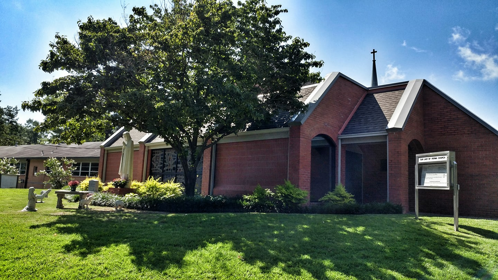
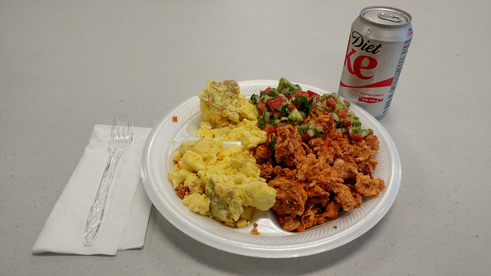

import { Image } from "astro:assets";
import imgLoanerTruck from "./jackson-loaner-monster-truck.original.jpg";

*This is the second half of [a story I left hanging for nine years](/posts/2026-06-14-last-summer-we-snowballed-jackson/). I cobbled this sequel together with much thanks to Claude and Facebook's Post export. Otherwise, I never would have completed this, given the growing count of stuff I want to do when I retire. I'm finishing the saga now as I look back on nine years of low-carb eating &mdash; and on the trip that was my ketogenic baptism. When we last left off, Katlyn's 2002 Honda Accord had surrendered its transmission in Jackson, Tennessee, and I'd posted a timeline to Facebook from a motel.*

---

## Friends, I am begging for your help

There is a particular flavor of helplessness reserved for the man arguing with a rental-car company from a parking lot off the bustling US 45 Bypass. The original plan had been simple: drop Katlyn and her Accord in Dallas, fly home, done. The Accord had other ideas. Now I needed a rental to finish the drive, which meant moving a reservation date. Enterprise indifferently informed me I would have to pay a $100 fee for moving the date. So I did what any aggrieved citizen of 2017 does &mdash; I took it to the people.

> Friends, I am begging for your help. Enterprise Rent-A-Car is giving me a raw deal, a $100 charge to change a start date. Please comment here on my post on the Enterprise FB community. Heightening the matter may help me out. Thanks!
>
> *&mdash; Facebook post, dated June 9, 2017*

The mob was sympathetic. Katlyn, doing the forensic work of the young, found an entire cohort of disgruntled Enterprise customers. My skepticism, already robust, matured into something closer to conviction.

By the end of that first full day in Jackson I had learned a small, durable truth, and posted it before bed:

> What a day. Journaling is like a bike helmet. You don't need [to keep or wear] one until you're falling.
>
> *&mdash; Facebook post, dated June 9, 2017*

## A chatty man and a missing license

There was a catch, and it was mine. You could not rent a car on a debit card away from home &mdash; not in 2017, anyway &mdash; and we did not travel with a credit card. We owned a few; we just kept them on ice, out of reach of unnecessary spending. So Elena overnighted me one of ours.

The card arrived overnight; some of the trappings of the 21st century were present. We went to collect the rental. The deadline was real: Katlyn had to be in Dallas by Saturday. The gentleman behind the counter did not share my sense of urgency.

> A funny thing happened at the car rental. Nice elder fellow worked the desk. Not the quickest, however. Loved to talk. And talk. And talk. I'm not one to rush where I'm the guest in a small town. By the time I was out of there, I was eager to leave, and Katlyn and I were racing to Dallas. 4 hours later, we stopped in Little Rock for lunch, when I discovered my driver's license and credit card were missing.
>
> Guess who had them?
>
> Atypically for this trip, we weren't pulled over. Not once. But I couldn't lodge without a Driver's license. So I camped at my daughter's brand-new apartment. Helping to make a splash for her first night with her new co-interns, as only I know how.
>
> He was aghast when he realized his mistake, though that and a quarter won't buy a coffee.
>
> *&mdash; Facebook post, dated June 11, 2017*

But there is something that post left out, because I didn't yet have words for it. The rental was a new Toyota Corolla, with a bevy of cool features we hadn't driven before. Our cars are usually at least a dozen years old &mdash; long paid off &mdash; so a new one was novelty enough on its own; and being in IT, I revel in features and gadgets, so I was happily marveling at all of it. What kept me driving, though, was something else: the bone-deep, near-narcoleptic fatigue that had shadowed every long drive of my adult life never arrived. Katlyn, who knew the old routine, kept offering to take the wheel. "If you don't mind," I told her, "this feels so good I just want to keep going." And so we did &mdash; Jackson to Little Rock non-stop, all the way to a Chipotle, where I reached for a credit card and a license that were both sitting back in Jackson, with a very chatty man.

You cannot check into a hotel without them, which is how I came to spend the night on the floor of Katlyn's new-to-her internship apartment, making a memorable first impression on her new co-interns. I had set out wanting unhurried, one-on-one time with my daughter; God, in His unsearchable wisdom, gave it to me &mdash; just not in any shape I would have chosen. *Be careful what you pray for; it may arrive itemized.*

And yet:

> And Katlyn is in Dallas!
>
> *&mdash; Facebook post, dated June 10, 2017*

She made it. Whatever else had gone sideways, the one non-negotiable thing had happened.

## The long way back

Then came the part nobody writes postcards about: the solo drive back to Jackson, alone, to wait on a transmission. I left early, partly so as not to disturb the new friendships already forming among Katlyn's intern cohort. My license, of course, was waiting back in Jackson &mdash; the one direction I was already headed.

The drive had its moments of serendipity. It was Sunday and I wanted to meet my obligation, so I stopped for Mass at [Our Lady of Fatima](https://olfbenton.org/) in Benton, Arkansas. I have always loved stepping into a church in a town I'm only passing through &mdash; a chance to see another community where the faith is plainly lived, where you can tell what matters to people and where their hearts are. This was exactly such a place.

:::cards

*One thing I love about traveling is visiting different churches. — Facebook post, dated June 11, 2017*

---

*Let the meal photos begin. My first post-Mass low-carb meal, courtesy of the Our Lady of Fatima Hispanic Ministry. Delicious! — Facebook post, dated June 11, 2017*
:::

*Revised 2026-07-21: Benton photos reformatted as a card layout.*

A few days into low-carb eating, and I was pleased to find no problem accommodating me. In fact, this generous meal required my "stop" hand, as I figured there were migrants much hungrier than me.

## Proud papa, marooned

Monday morning, the thing this whole circus had been *for* finally arrived. It was no small thing: of the twenty students Neiman Marcus selected that year, Katlyn was one of the few not from an Ivy League school. So I posted what any father would:

> Forget everything else. Katlyn's Dallas internship starts today. I am a proud papa.
>
> *&mdash; Facebook post, dated June 12, 2017*

I, meanwhile, was a proud papa in a La Quinta in Jackson, Tennessee. I worked for Duke University at the time, and being in IT, we had mastered remote work &mdash; so I worked from Jackson while I waited for the car. It was like a preview of the COVID days to come.

> My universe is slowly imploding back into place. Can't wait to get home.
>
> *&mdash; Facebook post, dated June 12, 2017*

"Imploding back into place" is the most earnest sentence I produced all week. And then the transmission part schooled me in a whole new definition of "overnight."

> Jackson update: here, overnight means 2 nights, which, through experience, I can understand. The, ahem, "overnighted" transmission part will arrive TUES morning. Car repair completion delayed to tomorrow, 2 PM-ish. A set-back of sorts. I remain optimistic I'll be home soon.
>
> For the record, this is a lousy town for walking. I suspect it's also lousy for "fooling around," but I'm no Johnny Cash.
>
> *&mdash; Facebook post, dated June 12, 2017*

For the uninitiated: Johnny Cash and June Carter Cash sang about [Jackson](https://www.youtube.com/watch?v=HGhCsznO0S8), though the Jackson I saw wasn't as wild as the song suggests.

## Carless in a car town

Carless in Jackson, I cobbled a new routine in my host city, with lots of walking. It is not a town built for walking &mdash; plenty of places are; Jackson is not one of them. Still, the town was good to a stranded out-of-towner: warm, unhurried, and patient with a man plainly not from around there.

<figure>
  <Image src={imgLoanerTruck} alt="An absurdly tall lifted monster truck parked at an auto shop in Jackson, TN" />
  <figcaption>They've arranged a loaner for me. 500 gallons to the mile. &mdash; Facebook post, dated June 13, 2017</figcaption>
</figure>

> Still not fixed. Stay tuned.
>
> *&mdash; Facebook post, dated June 13, 2017*

## Habemus auto

And then, on Tuesday, the white smoke:

> Habemus auto.
>
> *&mdash; Facebook post, dated June 13, 2017*

*We have a car.* [Bill's Transmissions](https://billstransmissionsjackson.com/) had done the work, the long-promised part had finally arrived, and the 2002 Honda Accord that had started the whole mess was whole again &mdash; ready by the end of the day. Bill was fair with us and did right by the car.

Which left me a last decision: take one more night in Jackson, or drive due east and run the sixteen-odd hours home in a single shot, straight through the night. Before this trip the question would have been laughable &mdash; I could barely keep my eyes open for a single hour, let alone a state. But I was not that man anymore. I chose the road. I drove into the dark with the rear right window taped up, a stash of processed sugar-free meats from a random roadside gas station riding along, and, for once, nothing revving that shouldn't, and somewhere in the small hours I watched dawn arrive as I ran east toward home &mdash; the same way this long way home had begun. It was not easy. But I was astonished then, and I am astonished still, at how completely that old, debilitating, near-narcoleptic fatigue had simply and utterly vanished.

So that was it. Not the trip I had planned &mdash; *the best laid schemes o' mice an' men*, and all that &mdash; but perhaps the trip I needed. I had wanted time with Katlyn, and I got it, in a form I would never have chosen and would not now trade. I had started a way of eating that, nine years on, is still with me &mdash; and I've come to suspect the chaos itself helped the change take hold. Stranded and on my own, I answered to no one about what I ate, and those long, clear-headed drives were an early harbinger of more unexpected health benefits to come from my dietary change. A smoother week might not have convinced me half so well. Tolkien had a word for a story that turns like this one: [*eucatastrophe*](https://en.wikipedia.org/wiki/Eucatastrophe) &mdash; the good catastrophe, the sudden turn where what looked like ruin opens onto grace instead. From that motel in Jackson it felt like ruin. It wasn't. And somewhere around the third night I was reminded that [Hebrews 12](https://www.biblegateway.com/passage/?search=Hebrews+12%3A6-7&version=NIV) never promises the discipline will be *fun* &mdash; only that it is the sort of thing a father does for a child he loves.

Here, dear reader, is how I got home &mdash; a journal entry nine years overdue.

*Some overnights take longer than others.*
