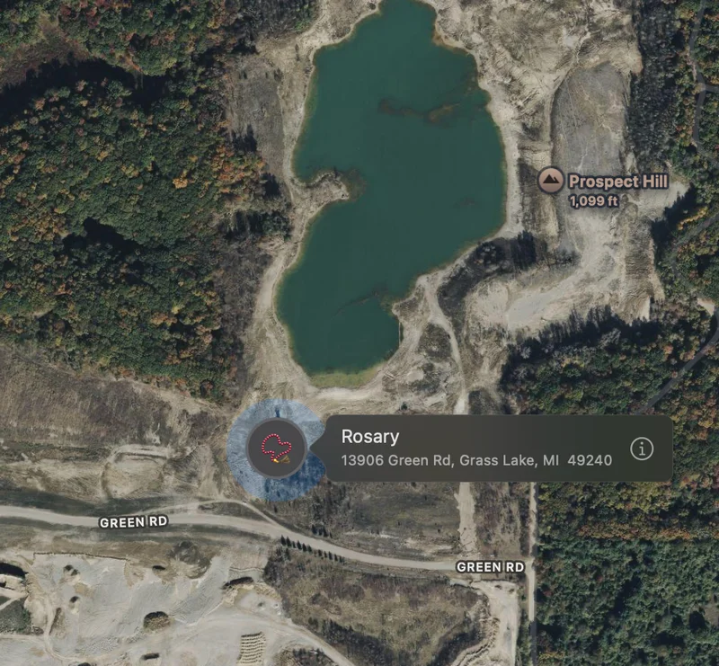
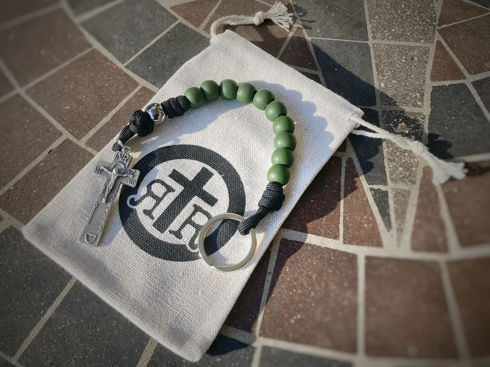

Though I was raised nominally Catholic, I made a hasty and complete exit in my teens. I returned to the faith after finding consolation amid increasing despair from my exploration of atheism. I had an epiphany of sorts in a small cinder-block Catholic church in Arkansas. It was there that I reverted to and renewed my faith. Once, while arriving early for Sunday Mass, I heard a repeated litany of "Hail Marys…" I couldn't describe it, but the cadence caught my attention. I wanted to understand what this was. That was my first introduction. Soon afterward, I would occasionally pray a Rosary, usually at a weekly men's group meeting, then, in time, more frequently. I was convinced there was something "there," however ineffable. I may not have always wanted to pray one at the start, but I was always glad when I finished. Then, maybe 15 years ago, I made it my daily practice as one of those successful New Year's Eve commitments that stuck. For the record, I have an excellent track record of meeting NYE commitments and succeeding, confounding those who dismiss them. I maintain a near-daily habit of saying the Rosary. Here's an [overview of the Rosary from EWTN](https://www.ewtn.com/catholicism/library/history-of-the-rosary-1142) if you are unfamiliar with the prayer.

Now that I had started a daily habit, I was looking for Rosary beads. I was only aware of the full "five decades" Rosary (apparently it's the prayer name AND the bead-and-string thingy). After acquiring a few inexpensive plastic-bead-and-crucifix Rosaries, I came across the [Rosary Army podcast, which explained how to make your own](https://rosaryarmy.com/make/), which is fun to do, and I still have the one I made. However, these are long and dangly, inconvenient to keep on me should I want to have my Rosary handy. Also, in the winter, feeling beads with cold, numb hands is difficult. With my own make, I could make the bead (really - a knot) as big as my big hands needed. As an aside, now, decades in (excuse the pun), I have more Rosaries than I know what to do with. Knowing my devotion to the Rosary, friends give me Rosaries as gifts. Thanks, friends, but like the Dennis Moore sketch, with its running lupins gag, I don't need any more Rosaries.

At some point, and I forget how, I learned that a single-decade Rosary was a thing, and that there was a "rugged" version of this. The company that makes these is named "Rugged Rosaries." They even make a [version for people serving in the forces](https://ruggedrosaries.com/collections/combat-rosaries). I'm not saying they're clumsy, but if their Rosaries can withstand the rigors of deployment, they can withstand my clumsy self. In 2020, I bought my first "pocket" Rugged Rosary, the "Copper Rattlesnake Pocket Rosary." I immediately connected with it, beyond my connection to the prayer tradition and the prayer beads. It is (well, was; keep reading) rugged; the large beads connect on a thick strand. Rugged Rosaries sells a variety of medal themes. I forget why the Copper Rattlesnake made sense then, but I've also bought several more since then, similar one-decade versions.

:::cards

*The last known location for my previous Rugged Rosary.*
:::

That's where the story gets interesting. If they're rugged, why have you bought more? Simple. I'm clumsy AND absent-minded. I lost my first Rosary on a morning run on some trail's woodsy floor. I replaced that with their "Leather, Wood, Silver St. Benedict Tenner Rosary - With Keyring." Since this was my third, I called on a little help, and not from St. Anthony, but rather Apple with their AirTag technology. More than a few times, I used the "Play Sound" feature to hear where they lay hidden, such as in pants pockets or behind furniture. I kept that Rosary for three years, until several months ago. My AirTag-ed Rosary slipped out of my pocket one late night while fumbling for keys and an iPhone flashlight. We were in Grass Lake, Michigan, for a wedding. I know where they fell; Apple's "Find My" told me, but here is where the technology falls short. They fell in a cellular dead zone. I knew roughly where they fell, but in the dark of night, there was no cellular signal to help me in real time while I was at the site (or maybe not?). I couldn't find them.

:::cards

*My second rosary, replacing the one I lost while jogging*
:::

Even with the late-night failure, I held out hope that the "Find My" tech would help me find it in daylight. Alas, 12 hours later, Find My showed them in a new location. They were now maybe a mile away, as if a deer (or raccoon?) had carried them off from where they'd dropped. "Find My" showed them off a gravel road near a lake. My first thought is, why would someone pick them up only to toss them? Despite lacking a clear motivator for the heist, I promptly made haste to the purported area. The area seemed clear of brush, enough, judging from the Apple satellite map, but it was not to be. It had a 2-3' growth of scrub and scratchy, thistle-like things that made sure they left a mark on my exposed lower legs. Despite an hour of frantic searching with as much coverage I could muster in the circumstances, I could not find it. Nor could Find My detect the Bluetooth signal when I tried to issue a "play sound" command.

So what happened to my first AirTag-fied Rosary? My first guess was "kids," because that's who we old people always blame. But then someone suggested wildlife as an explanation, which satisfied Occam's Razor. I don't know how or why, but given where it was from, where Find My originally said it was missing, that's my current and likely final guess. For all I know, someone will find my Rosary years from now, tangled in the ribs of a deer carcass.

This seems like a long-way-around recommendation for a Rosary—and that's the point. I have maybe 20 Rosaries. But only Rugged Rosaries are worth all of this. Yes, I treat my rosaries with care. (Come to think of it, I should have my priest bless my latest rosary.) But I love the feel of the Rugged Rosary when I'm praying. The beads slipping through my clenched fingertips. How the beads gently wear with daily use over time, yet remain as reliable as the day they arrived. As a big guy, this fits comfortably in my pocket. YMMV. I regularly take it into the elements—running, sweat, rain—and none of that has ever been a problem; no special handling required. Then there's the rosary my daughter brought back from Ecuador, which, of course, I love, but I would never think of using it for jogging or my outdoor hikes. All the Rugged Rosaries I've had are solidly built. They're quietly beautiful. I also like that Rugged Rosaries is based in Houston, TX, American-made, and hand-built. When I've had questions, the company has been helpful and responsive. That's a lot of value for a low-priced (in my estimation) rosary.

So, yes, I recommend Rugged Rosaries. More importantly, I recommend a daily Rosary habit. If you're looking for a way to grow in this ancient, beautiful, and satisfying practice, you should check out [The Rosary in a Year podcast](https://www.youtube.com/@TheRosaryinaYear). I thought I already knew the Rosary well by the time I started listening, but the podcast taught me plenty I didn't know. And, as I've learned over time, all 10 fingers make for great ad-hoc beads. You don't need a rosary. But when you get your habit going, check Rugged Rosaries out.
