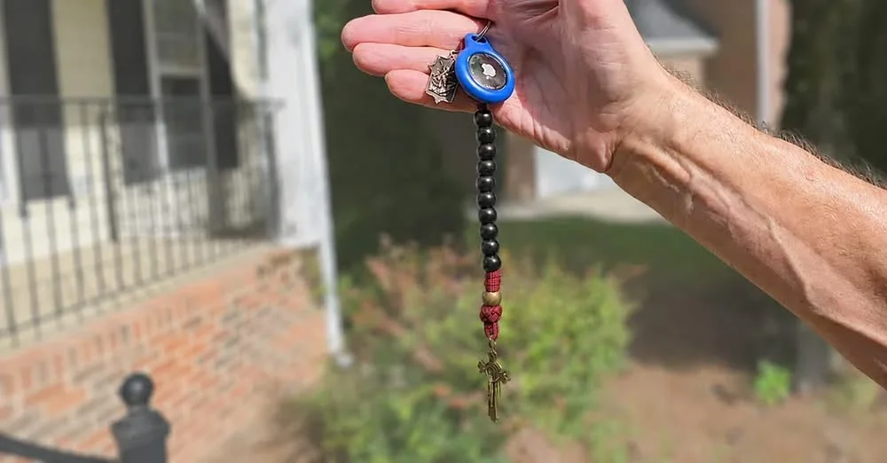

This paragraph is where the post body starts. Paragraphs, headings, bulleted/numbered lists, code blocks, quotes, dividers, and images all convert automatically to Markdown.

## A heading, for structure

Unsupported block types (tables, embeds, columns, synced blocks) land as an HTML comment marker (`<!-- MIGRATION: unsupported block "type" omitted -->`) in the generated Markdown — search the PR diff for `MIGRATION:` and fill those in by hand. Nested content (a toggle, callout, or sub-list indented under another block) isn't fetched at all and gets the same kind of marker.

*This image's Notion caption becomes the post's *`alt`* text and, via the first image in the page, its hero *`image`* — it is separate from the page-level *`Caption`* property above, which becomes the post's frontmatter *`caption`* field (e.g. a photo credit shown under the hero image).*

---

**Using this template:**

1. Duplicate this page (or use the database's "New template" picker once this page has been designated as a template — see the repo's `docs/getting-started/creating-posts.md`).

2. Rename it to your post's actual title.

3. Fill in `Description`, `Tags`, and `Caption` above, and replace this body with your real content.

4. Set `Status` to `ready to post` when done. `pubDate` is set automatically to the migration date; it is not a property here.
